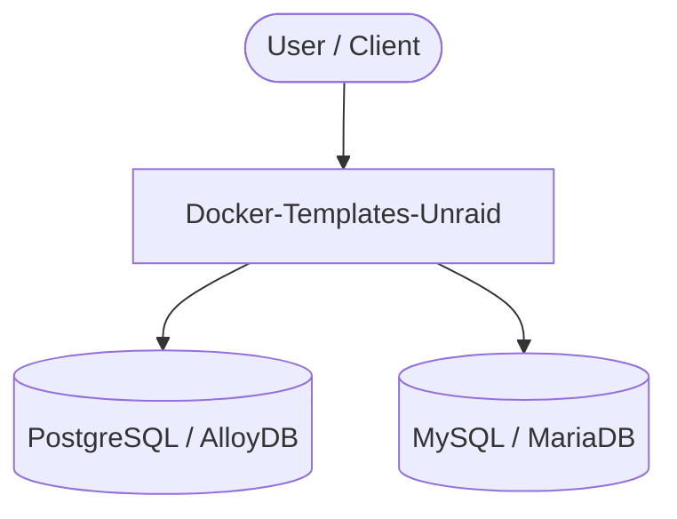

# Context Map — `Docker-Templates-Unraid`

> Auto-generated architecture & deployment context map. Summarizes the core application, container/cloud footprint, and database connections. Regenerate after significant structural changes.

**Repo:** `avnit/Docker-Templates-Unraid` · **Fork** · Public · Primary language: - · Default branch: `master` · Files: 45

**Description:** Unraid docker templates

## 1. Core application

- **Listens on port(s):** 80, 3306, 5000, 5432, 8000, 8080

## 2. Containers & cloud applications

_No container, Kubernetes, IaC, or cloud-deploy manifests detected. Runs as a local script/library or static site._

## 3. Database connections

**Datastores in use:** PostgreSQL / AlloyDB, MySQL / MariaDB

## 4. Architecture diagram

## 5. Security posture

- No open Dependabot alerts or static-scan findings recorded.

---
_Generated by repo context-mapping pass on 2026-08-13._